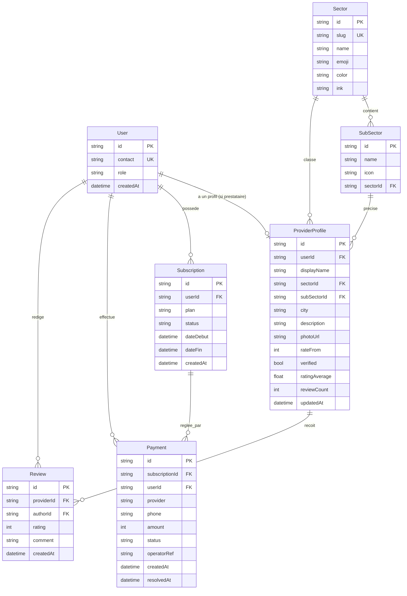

# Schéma de base de données (#45)

Ce document décrit le schéma relationnel prévu pour remplacer les stores en
mémoire actuels (`server/utils/*Store.ts`) par une vraie base de données. Le
schéma est défini dans [`prisma/schema.prisma`](../prisma/schema.prisma) et
versionné via une migration initiale dans `prisma/migrations/`.

**Portée de ce lot :** conception, validation et documentation du schéma +
migration initiale exécutable. Le branchement de l'application sur cette base
(remplacement effectif des stores en mémoire par des requêtes Prisma) est un
chantier séparé, une fois l'architecture API stabilisée (#46).

## Choix technique

- **ORM :** [Prisma](https://www.prisma.io/) — migrations versionnées,
  client TypeScript généré et typé, bon support SQLite/PostgreSQL.
- **Provider de dev :** SQLite (fichier local, zéro dépendance externe).

> **⚠️ Portabilité SQLite → PostgreSQL — précision (pré-audit).**
> Le passage à PostgreSQL **n'est pas** un simple changement de `datasource.url` :
> `datasource.provider` est fixé à `"sqlite"` dans `schema.prisma`. Migrer vers
> Postgres impose de **changer le provider** *et* de **régénérer les migrations**
> (les migrations SQLite existantes ne rejouent pas telles quelles sur Postgres).
> C'est une opération de bascule à part entière, à planifier avec le choix
> d'hébergement (voir `docs/deployment.md`) — pas un swap d'URL transparent.

## Diagramme (ERD)



## Correspondance avec les stores en mémoire actuels

| Modèle Prisma      | Store équivalent                       | Notes |
|---------------------|-----------------------------------------|-------|
| `User`              | `server/utils/userStore.ts`             | `contact` reste la clé d'identification (téléphone ou email), `role` figé à la création (#19). |
| `Sector`/`SubSector` | `app/data/sectors.ts` (statique, #8)   | Données actuellement codées en dur côté client ; migrent vers des lignes seedées pour permettre une gestion future (ajout/désactivation de secteurs sans déploiement). |
| `ProviderProfile`   | `server/utils/providerStore.ts` (#26, #27) | Ajoute les champs requis par les cartes de résultats (#41) absents du store actuel : `displayName`, `city`, `verified`, `ratingAverage`, `reviewCount`. `sector` (slug) devient une relation `sectorId`. |
| `Review`            | *(aucun équivalent)*                    | Nouveau modèle : aucune route API d'avis n'existe encore dans ce lot, mais `ProviderProfile.ratingAverage`/`reviewCount` en dépendent conceptuellement. |
| `Subscription`      | `server/utils/subscriptionStore.ts` (#29, #30) | `status` reprend les valeurs `en_attente \| actif \| expire` déjà utilisées. |
| `Payment`           | `server/utils/paymentStore.ts` (#32, #34) | `provider` (`flooz \| tmoney`) et `status` (`pending \| confirmed \| failed`) repris à l'identique. |
| `WalletMovement`    | `server/utils/walletStore.ts` (#192)    | Socle #46. Journal append-only ; le solde reste recalculé, jamais stocké. |
| `EscrowOrder`       | `server/utils/escrowOrderStore.ts` (#194-#197) | Socle #46. Reprend le cycle de vie `awaiting_payment → in_escrow → delivered → released/refunded/disputed`. |
| `Conversation`/`Message`/`ConversationRead` | `server/utils/conversationStore.ts` (#59, #129, #225) | Socle #46. `ConversationRead` porte le `lastReadAt` par utilisateur (compteur de non-lus). |

> **Socle #46 (pré-audit).** Les modèles `WalletMovement`, `EscrowOrder`,
> `Conversation`, `Message` et `ConversationRead` sont **modélisés mais pas
> encore branchés** : l'application lit/écrit toujours les stores en mémoire
> correspondants. Le branchement effectif (remplacement des `Map` par des
> requêtes Prisma, dans des transactions pour les mouvements de portefeuille)
> est le chantier de suivi, à réaliser une fois la cible base/hébergement
> tranchée. Sans cette bascule, aucune donnée de portefeuille, de séquestre ou
> de messagerie ne survit à un redémarrage et le multi-instance est impossible.

## Commandes

```bash
# Générer le client Prisma (après un git pull qui modifie le schéma)
npm run db:generate

# Créer/appliquer une nouvelle migration en dev
npm run db:migrate

# Explorer les données via l'UI Prisma Studio
npm run db:studio
```

`DATABASE_URL` est lu depuis `.env` (non versionné, voir `.env.example` si
besoin d'une valeur de départ : `DATABASE_URL="file:./dev.db"`).

## Critères d'acceptation (#45)

- [x] Schéma validé et documenté (diagramme ci-dessus + migration initiale
      dans `prisma/migrations/20260712065934_init/`).
- [x] Couvre tous les champs utilisés par le frontend (#26 secteur, #29/#33
      abonnement/paiement, #41 cartes prestataires : nom, sous-secteur,
      ville, note, avis, prix, vérifié, photo).
